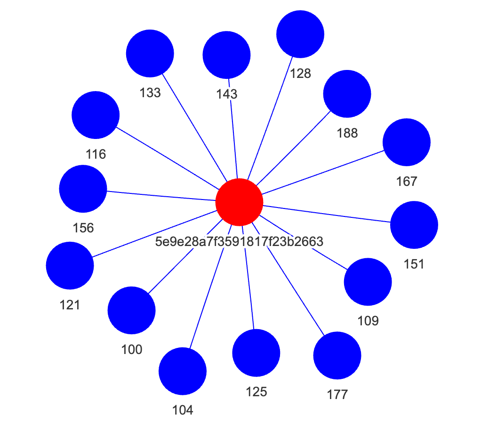

# SpaceX API - Data Engineering Project

## ETL for `/launches` endpoint
👋 Hey! This is a repository that contains the application that Extracts, Transforms, and Loads `launches` data from SpaceX API
into a Postgres database, and run a few queries on top of it. Tools used are Python, Postgres, Docker, Docker Compose, MinIO

It also contains some theoretical explanations regarding AWS architecture, Kubernetes orchestration, and Terraform development.
Follow this README file and click on the links as directed for detailed explanations of each section.

## Table of Contents
1. [How to run this application?](#how-to-run-this-application)
2. [Part 1 - Data Infrastructure on AWS](#data-infrastructure-on-aws)
3. [Part 2 - Orchestration and Container Management with Kubernetes](#orchestration-and-container-management-with-kubernetes)
4. [Part 3 - ETL Pipeline](#etl-pipeline)
5. [Part 4 - SQL Queries](#sql-queries)

## How to run this application?
Please refer to [docs/setup.md](docs/setup.md) for further instructions.

## Data Infrastructure on AWS
Refer to [docs/part_1_architecture_and_security.md](docs/part_1_architecture_and_security.md) for architectural diagrams and security discussions in AWS.

For a discussion on configuring Terraform to create a simple Redshift cluster on AWS, refer to [docs/part_1_terraform_redshit.md](docs/part_1_terraform_redshit.md).

## Orchestration and Container Management with Kubernetes
For steps on deploying a Kubernetes cluster and configuring monitoring and logging, refer to [docs/part_2_kubernetes.md](docs/part_2_kubernetes.md).

## ETL Pipeline
The script that extracts, transforms, and loads data can be found at [app/processing/launches.py](app/processing/launches.py).

For further explanation, refer to [docs/part_3_etl.md](docs/part_3_etl.md).

For information on scheduling and monitoring this pipeline using Apache Airflow, refer to [docs/part_3_airflow.md](docs/part_3_airflow.md).

## SQL Queries
SQL queries for

* finding the maximum number of times a core has been reused;
*  the cores that have been reused in less than 50 days after the previous launch.

can be found at [max_core_reuse.sql](app/sql/max_core_reuse.sql) and [cores_less_than_50_days.sql](app/sql/cores_less_than_50_days.sql), respectively.

---

**Extra:** The below image shows the core that has been reused the most (14 times) and each flight it was used.

