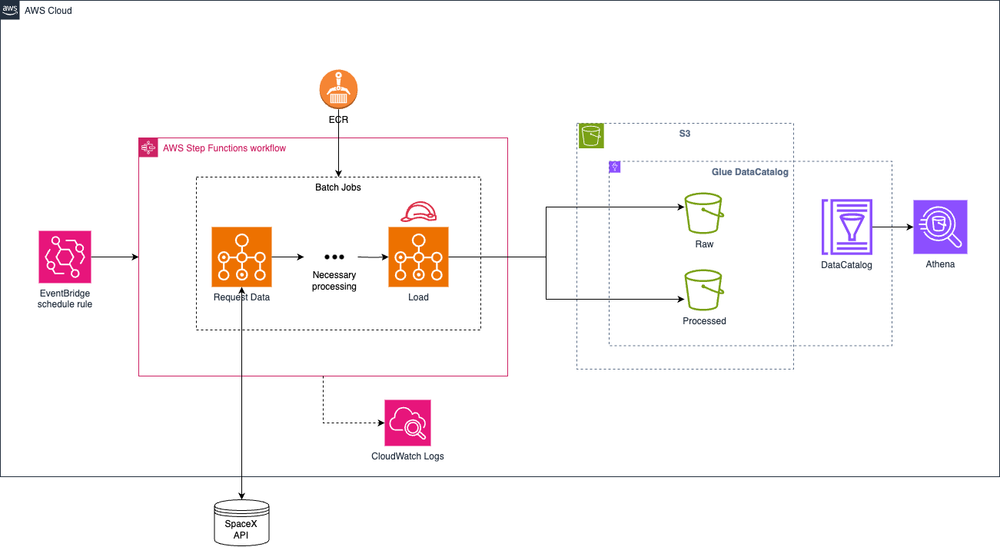

# Data Infrastructure on AWS

## Scalable Architecture

A few assumptions were made to come up with this final architecture:
* **Batch Processing**: this assumes that we have regular batches of processing, not real-time processing;
* **OLAP**: the architecture should serve an OLAP data warehouse or similar storage tool (lake a data lakehouse in this case), instead of an OLTP db.
* **Data Schema**: has predictable schema so it can be stored in a relational database-like format.
* **Latency**: there's no need of real time analytics.
* **Cost-effectiveness**: considering the most optimal scenario of cheap solution and high scalability.
* **Amount of data**: can store and analyze hundreds of TBs if needed.
* **Management**: simplified infrastructure management (minimal).

It consists of a scalable, highly-available, and cost-effective serverless architecture made out of the following services:
* **AWS Batch**: data processing service that runs a specified script in a specified environment (container).
* **AWS S3**: data lake to store objects (e.g. raw .json and processed .parquet).
* **AWS Step Functions**: orchestrator to call services in a specified order.
* **AWS Glue Data Catalog**: catalogs objects sitting on S3 by storing metadata, and enabling objects to behave like database tables for example.
* **AWS Athena**: can query Glue database with PrestoDB SQL syntax for analyzing data.
* **AWS ECR**: stores base images that Batch uses to run scripts.
* **AWS EventBridge**: schedules step function trigger chronologically or in response to events.
* **AWS CloudWatch**: centralize logs for different services.
* **AWS IAM**: controls services' roles, policies, etc.

This architecture can handle hundreds of TBs of data, might be a way cheaper solution thatn instantiating Redshift for example due to serverless nature - meaning instances shut down after used. All TBs of data stored reliably on S3 can be queried through Athena by setting up properly Glue DataCatalog as they were DB tables.

Other stacks were evaluated, e.g. running airflow in a dedicated instance - or managed service, as well as running Argo on a Kubernetes cluster, but this architecture was preferred over others due to cloud-native, scalability, cost-effectiveness, infrastructure management, and other advantages listed above. Some disadvantaged of it might be the limited customization (compared to highly customizable running own kubernetes cluster), but complexity pays off.

---

## Security and Access Control

1. **IAM Policies and Roles**: With AWS Identity and Access Management (IAM), roles with distinct permissions can be created and assigned to services, ensuring secure access to AWS resources. Roles can be reused and are better alternatives than resource policies.

2. **Encryption**: I would implement encryption both at rest and in transit. For instance, S3 server-side encryption can be activated to automatically encrypt all data stored in S3.

3. **VPC**: For services that can operate within Amazon Virtual Private Cloud (VPC), such as AWS Batch, I would utilize VPC to create a private network. This enables control over inbound and outbound traffic using security groups and network ACLs. For services that do not reside within a VPC, like Athena and S3, I would configure VPC endpoints to ensure 'private' and secure traffic between the VPC and these services, not using the public internet.

4. **Secrets Manager**: To securely store and retrieve sensitive information like database credentials, I would use AWS Secrets Manager.

5. **Users**: If users need to interact with services either for developing or maintaining, IAM Users can be created, always keeping in mind AWS's Least Privilege Principle when setting permissions through policies.

   