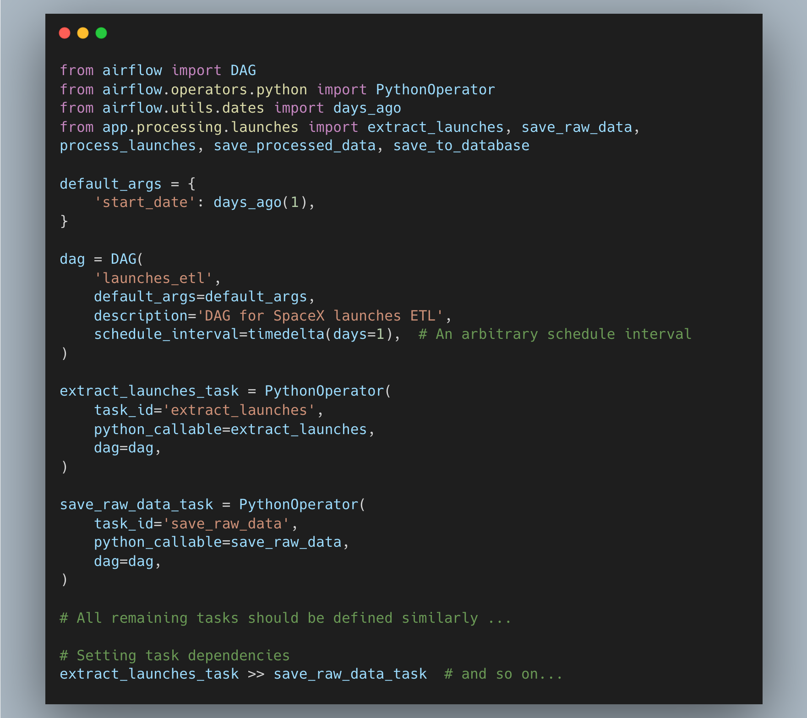
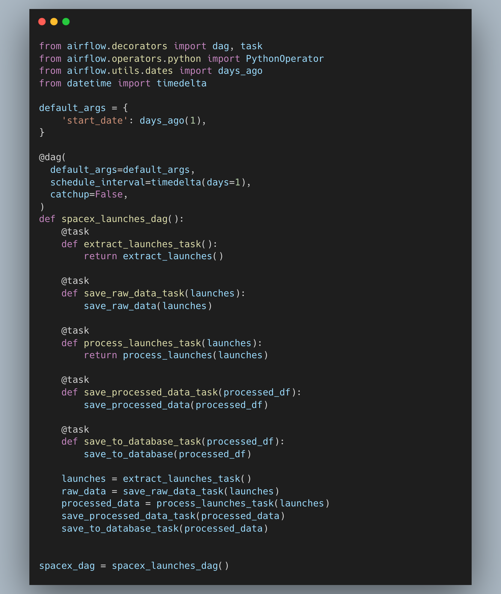
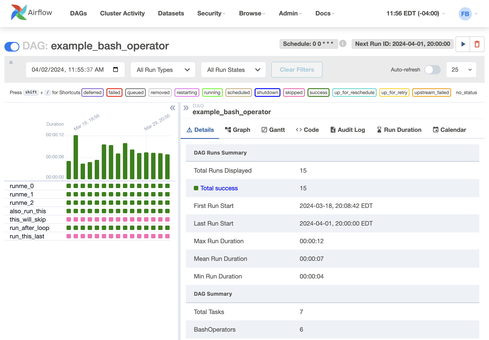

# ETL Pipeline

## Explain how you would schedule and monitor this pipeline using tools like Apache Airflow.

Assuming we already have an Airflow instance ready to use, I would proceed as follows:

First of all, I would need to have the `app/` folder available to be imported while writing my DAG definition. This way I would use PythonOperators to run all functions in a manner similar to how they would be executed in pure Python, as shown below:




We could also implement the more recent Airflow approach of defining DAGs and tasks, which involves using decorators. This would be even more similar with the pure python approach, i.e.



## Scheduling
Depending on data requirements, DAG scheduling can be set during the DAG definition by using the schedule_interval parameter, as shown below:
```
@dag(
    default_args=default_args,
    schedule_interval=timedelta(days=1), # Either cronjob, timedelta
    catchup=False
)
def spacex_launches_dag():
    ...
```
Alternatively, Hooks can also be configured to trigger DAGs in response to specific events, as opposed to chronological scheduling.

## Monitoring
Airflow webserver provides sufficient tools to monitor DAG runs, for both historical and real-time monitoring, providing logs for each task instance. In case of failures, an email alert or other messaging systems like Slack can be set up by leveraging Airflow's [Notification](https://airflow.apache.org/docs/apache-airflow-providers/core-extensions/notifications.html) system (`SlackNotifier`, `SmtpNotifier`, etc.).

Airflow Grid from documentation:



